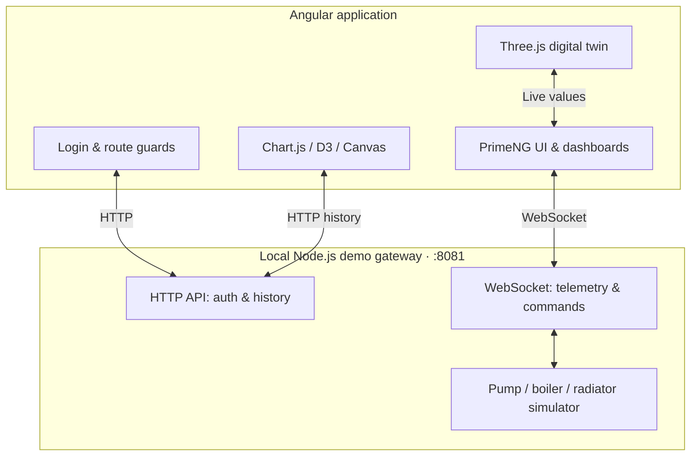

<div align="center">

# 💧 HYDRO CONTROL

### Industrial IoT Monitoring · Smart Pump Control · Interactive 3D Digital Twin

**A modern operations dashboard for exploring connected water and heating infrastructure.**

[](https://angular.dev/)
[](https://primeng.org/)
[](https://www.typescriptlang.org/)
[](https://threejs.org/)

[](https://www.chartjs.org/)
[](https://d3js.org/)
[](https://developer.mozilla.org/en-US/docs/Web/API/WebSocket)
[](#internationalization--responsive-design)

[**Explore Features**](#-features) · [**Get Started**](#-quick-start) · [**3D Editor**](#-interactive-3d-editor) · [**Architecture**](#-architecture) · [**راهنمای فارسی**](#-راهنمای-سریع-فارسی)

---

**Monitor. Control. Simulate. Visualize.**

</div>

> [!IMPORTANT]
> **Simulation / portfolio project — not a production industrial controller.** Data is generated by a local mock gateway. The included `admin / admin` credentials and session handling are for demonstration only. Do not expose the mock service publicly or connect it to physical machinery without proper security, safety interlocks, and an industrial-grade backend.

## ✨ Overview

**Hydro Control** is a responsive web application built with **Angular 21**, **PrimeNG** and **Three.js**. It brings pump telemetry, hydronic heating, event monitoring, historical charts, and an editable equipment scene together in one dashboard. A lightweight Node.js API + WebSocket simulator powers the demonstration locally, so **no physical sensors or PLC hardware are required** to explore the UI.

## 🚀 Features

| Module | Capabilities |
| :--- | :--- |
| 💠 **Overview Dashboard** | Pressure, flow, RPM, motor temperature, power, tank level, equipment and system status |
| 🎛️ **Pump Controller** | Start/stop, automatic/manual/off modes, pressure setpoint and valve adjustment |
| ♨️ **Heating System** | Boiler and burner monitoring, heat-exchanger temperatures, five radiators and individual valve control |
| 📈 **Telemetry & Analytics** | Live and simulated historical trends, point tooltips, zoom/pan, separate flow/pressure axes |
| 🔔 **Alarm Journal** | Events by severity, acknowledgment, colored status indicators and pagination |
| 🧊 **3D Digital Twin** | Interactive equipment, explodable/focus views, part labels and per-part visual properties |
| 🌐 **Interface** | Persian/English, RTL/LTR, Vazir font for Persian, dark/light themes |
| 📱 **Responsive** | Collapsible sidebar on desktop and persistent five-item bottom navigation on smaller screens |

### Telemetry time windows

`Live` · `1 hour` · `24 hours` · `7 days` · `30 days`

Historical ranges are **generated for the demo** and must not be interpreted as stored readings from real equipment.

## 🧊 Interactive 3D Editor

The 3D equipment viewer includes an **interaction lock enabled by default** to prevent accidental camera movements or edits.

1. **Unlock** the scene to orbit, pan, and zoom the camera.
2. Enable **Part labels**, then select a labeled component.
3. Open that component's visual controls to adjust **visibility, material color, opacity, and roughness**.
4. **Focus** the camera on the selected part or reset its appearance.
5. **Lock** the scene again to prevent unintended interactions.

Available parts include the pump assembly, impeller, boiler, radiators, tank, and imported models. These edits affect **visual representation only** and do not change pump operating commands.

#### Model import and export

| Format | Import | Export | Notes |
| :---: | :---: | :---: | :--- |
| **GLB** | ✅ | ✅ | Recommended for convenient, self-contained exchange |
| **glTF** | ✅ | ✅ | May require companion `.bin` and texture files |
| **OBJ** | ✅ | ✅ | Optional `.mtl` and textures when importing; limited material support |
| **STL** | ✅ | ✅ | Mesh geometry; limited color/material information |

The editor can export the **complete equipment scene** or a **selected part**. Imported models are normalized and kept separate from the simulated built-in equipment. Import limits are **40 MB per file** and **100 MB total**; unsupported compression (such as Draco) requires an additional decoder.

➡️ Read the detailed instructions in [**3D Editor Guide**](UI-V29-3D-INTERACTION.md).

## 🛠 Tech Stack

| Layer | Technology |
| :--- | :--- |
| Frontend | Angular 21 (standalone components, Signals, lazy-loaded routes), TypeScript 5.9 |
| UI & styling | PrimeNG 21, PrimeIcons, PrimeUIX themes, component HTML/CSS, Vazir |
| Charts & gauges | Chart.js, `chartjs-plugin-zoom`, D3.js, Canvas |
| Interactive 3D | Three.js, import/export modules |
| Demo backend | Node.js HTTP server + `ws` WebSocket |
| Development tools | Angular CLI, concurrently |

## 🏗 Architecture



The built-in gateway simulates equipment behavior and broadcasts telemetry. The frontend receives live states and can send demo commands. Authentication, data history and the equipment state are **local demo implementations**, not a real industrial control stack.

## ⚡ Quick Start

### Prerequisites

- **Node.js 22+**
- **npm**
- A modern browser with WebGL support for the 3D viewer

### Install and run

```bash
# Clone your repository (replace with your own repository URL)
git clone https://github.com/YOUR_USERNAME/hydro-control.git
cd hydro-control

# Install dependencies
npm install

# Start Angular and the local mock API/WebSocket server
npm run dev
```

| Service | Local URL |
| :--- | :--- |
| 🖥️ Application | **http://localhost:4200** |
| 🔌 HTTP API | **http://localhost:8081** |
| ⚡ WebSocket | **ws://localhost:8081** |

**Demo login:** `admin` / `admin`

Alternatively, run the services separately:

```bash
npm run start   # Angular on :4200
npm run mock    # Demo API + WebSocket on :8081
```

### Build and test

```bash
npm run build
npm run test
```

> [!NOTE]
> A complete production build and end-to-end WebGL verification have **not** been confirmed in the current delivery environment. Validate the application locally before production use or publication of a release.

## 📁 Project Structure

```text
hydro-control/
├── src/
│   ├── app/
│   │   ├── core/
│   │   │   ├── auth/              # Demo authentication & guards
│   │   │   ├── i18n/              # Persian/English translations
│   │   │   ├── models/            # Telemetry/command types
│   │   │   ├── services/          # WebSocket and history clients
│   │   │   └── theme/             # Light/dark preferences
│   │   ├── features/
│   │   │   ├── auth/              # Login page
│   │   │   ├── dashboard/
│   │   │   │   ├── components/    # One folder per 3D/gauge/control component
│   │   │   │   └── dashboard.component.*
│   │   │   ├── analytics/         # Process analysis
│   │   │   ├── heating/
│   │   │   │   ├── components/    # Heating panels & room heat map
│   │   │   │   └── pages/         # Heating page
│   │   │   ├── alarms/            # Alarm journal
│   │   │   └── settings/          # Configuration view
│   │   └── layout/               # Shell and navigation
│   └── styles/                   # PrimeNG integration and Vazir styles
├── server/mock-ws.mjs           # Simulated HTTP + WebSocket gateway
├── scripts/verify-vazir.mjs     # Font dependency verification
├── angular.json
└── package.json
```

Every Angular UI component uses separate **`.ts`**, **`.html`**, and **`.css`** files. Dashboard and heating subcomponents are organized into their own component folders.

## 🌍 Internationalization & Responsive Design

- 🇮🇷 **Persian (FA)** with right-to-left layout and Vazir typography.
- 🌐 **English (EN)** with left-to-right layout.
- 🌗 **Dark/light themes** across controls, charts, tables and 3D overlays.
- 🖥️ **Desktop:** collapsible sidebar.
- 📱 **Up to 920 CSS px:** persistent bottom navigation with five main destinations.

**Font setup:** `vazir-font@30.1.0` is an npm dependency. `scripts/verify-vazir.mjs` verifies the WOFF2 files, while `angular.json` copies them from `node_modules/vazir-font/dist` to `/fonts` during the build. The source repository intentionally **does not include font binaries**. Run `npm install` and reload the browser if fonts seem missing.

## 🔌 Demo API

| Method | Endpoint | Purpose |
| :---: | :--- | :--- |
| `POST` | `/api/login` | Demo sign-in |
| `GET` | `/api/session` | Validate session |
| `POST` | `/api/logout` | Clear demo session |
| `GET` | `/api/history?range=1h` | Get demo trend samples for supported ranges |
| `WS` | `ws://localhost:8081` | Live telemetry and control messages |

The mock server is configured for local development. Never treat its credentials, allowed origins, or authorization mechanism as production-safe.

## 📚 Documentation

- [3D editor: lock, properties, import and export](UI-V29-3D-INTERACTION.md)
- [Component folder architecture](UI-V28-STRUCTURE.md)
- [GitHub upload instructions](GITHUB-UPLOAD.md)
- [Recent UI improvements](UI-V27-CHANGES.md)

<details>
<summary><b>🇮🇷 راهنمای سریع فارسی</b></summary>

### درباره پروژه

**Hydro Control** یک نمونه آموزشی از سامانه پایش و کنترل پمپ آب، پکیج گرمایشی و پنج رادیاتور است که با **Angular 21، PrimeNG، Three.js و WebSocket** ساخته شده است. نمودارها و اطلاعات دستگاه‌ها توسط سرور آزمایشی تولید می‌شوند و به تجهیزات واقعی متصل نیستند.

### اجرای پروژه

```bash
npm install
npm run dev
```

سپس نشانی `http://localhost:4200` را باز کنید و با نام کاربری `admin` و رمز عبور `admin` وارد شوید.

در بخش سه‌بعدی، صحنه به‌صورت پیش‌فرض **قفل** است. برای زوم، چرخش و انتخاب برچسب قطعات، ابتدا قفل را باز کنید. سپس می‌توانید ظاهر قطعات را تغییر دهید یا مدل سه‌بعدی با فرمت **GLB، glTF، OBJ یا STL** وارد یا صادر کنید.

**هشدار:** اطلاعات ورود و داده‌های پروژه کاملاً آزمایشی هستند. این نسخه برای کنترل تجهیزات صنعتی واقعی مناسب نیست.

</details>

---

<div align="center">

**Built for learning, visualization and engineering demonstrations.**

<sub>Hydro Control · Interactive Industrial IoT Demo · v2.9</sub>

</div>
